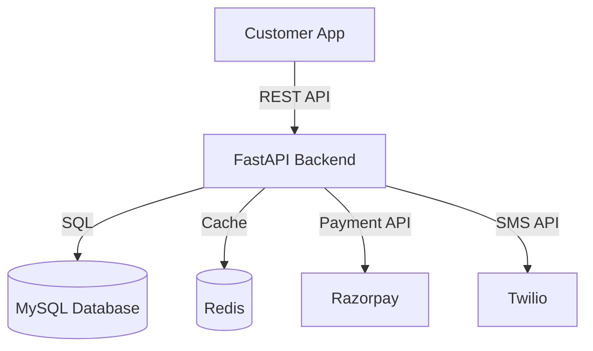

# System Design Document

**Module 16 -- Spec-Kit Development Methodology | Topic 3**

---

## What is System Design?

System design is the process of defining the architecture, components, and data flow of a software system. If the PRD is the "what," the system design document is the "how" -- at a high level.

Think of it like designing a city. Before laying roads, you need to decide where residential areas, commercial zones, hospitals, and schools will be. You need to plan water supply lines, electricity grids, and sewage systems. System design does the same for software: it decides what components exist, where they live, and how they connect.

---

## The C4 Model: Four Levels of Zoom

The C4 model, created by Simon Brown, gives you four levels of detail for describing a system's architecture. Think of it like Google Maps -- you can zoom in from the country level to the street level.

### Level 1: System Context Diagram

The highest level. Shows your system as a single box and its relationships with users and external systems.

```
+-------------+          +-------------------+
|  Customer   | -------> |   QuickKart App   |
+-------------+          +-------------------+
                               |         |
                               v         v
                    +----------+    +-----------+
                    | Payment  |    |   SMS     |
                    | Gateway  |    |  Service  |
                    | (Razorpay)|   | (Twilio)  |
                    +----------+    +-----------+
```

**Who needs this:** Everyone -- product managers, developers, stakeholders.

### Level 2: Container Diagram

Shows the major "containers" (applications, databases, message queues) inside your system.

```
+--------------------------------------------------+
|                   QuickKart System                |
|                                                  |
|  +------------+    +-------------+    +--------+ |
|  | React App  |--->| FastAPI     |--->| MySQL  | |
|  | (Frontend) |    | (Backend)   |    |  (DB)  | |
|  +------------+    +-------------+    +--------+ |
|                         |                        |
|                    +----------+                  |
|                    |  Redis   |                  |
|                    | (Cache)  |                  |
|                    +----------+                  |
+--------------------------------------------------+
```

**Who needs this:** Developers and architects.

### Level 3: Component Diagram

Zooms into one container to show its internal components (modules, services, controllers).

```
+---------------------------------------------+
|              FastAPI Backend                 |
|                                             |
|  +----------+  +-----------+  +-----------+ |
|  |  Auth    |  |  Orders   |  | Products  | |
|  |  Module  |  |  Module   |  |  Module   | |
|  +----------+  +-----------+  +-----------+ |
|  +----------+  +-----------+                |
|  | Payment  |  | Delivery  |                |
|  |  Module  |  |  Module   |                |
|  +----------+  +-----------+                |
+---------------------------------------------+
```

**Who needs this:** Developers working on that container.

### Level 4: Code Diagram

The most detailed level -- class diagrams, function signatures. Usually auto-generated from code, not manually drawn.

**Who needs this:** Individual developers working on specific components.

---

## Drawing Architecture Diagrams

You do not need expensive tools to draw architecture diagrams. Here are free options:

| Tool | Type | Best For | Cost |
|------|------|----------|------|
| draw.io (diagrams.net) | Web-based | All diagram types | Free |
| Excalidraw | Web-based | Quick, sketch-style diagrams | Free |
| Mermaid | Text-based (Markdown) | Diagrams in documentation | Free |
| PlantUML | Text-based | UML diagrams | Free |
| Figma | Design tool | Polished diagrams for presentations | Free tier |

### Mermaid Example (Text-to-Diagram)

You can write diagrams as code using Mermaid syntax. This is especially useful because diagrams live alongside your documentation in Git.



---

## Data Flow: How Information Moves

A data flow diagram shows how data enters, moves through, and exits your system. Here is an example for a food order:

```
Customer places order
    |
    v
React App sends POST /orders with cart items
    |
    v
FastAPI validates the request
    |
    v
Order saved to MySQL (status: "pending")
    |
    v
Payment request sent to Razorpay
    |
    v
Razorpay webhook confirms payment
    |
    v
Order status updated to "confirmed"
    |
    v
Store owner dashboard shows new order
    |
    v
Store owner marks order as "dispatched"
    |
    v
Customer gets SMS: "Your order is on the way!"
```

---

## Choosing a Tech Stack

The tech stack is the set of technologies used to build the system. Here is how to think about the decision:

### Decision Table for a Typical Full-Stack Project

| Layer | Options | Recommended (for this course) | Why |
|-------|---------|-------------------------------|-----|
| Frontend | React, Vue, Angular, Astro | React | Large ecosystem, job market demand |
| Backend | FastAPI, Django, Express, Spring | FastAPI | Async, fast, Python-based |
| Database | PostgreSQL, MySQL, SQLite | PostgreSQL (production), SQLite (dev) | Reliable, feature-rich |
| Cache | Redis, Memcached | Redis | Versatile, widely used |
| Auth | Firebase, Auth0, custom JWT | Firebase | Easy setup, free tier |
| Hosting | AWS, Azure, VPS, Vercel | VPS + Vercel | Cost-effective for startups |
| CI/CD | GitHub Actions, Jenkins, GitLab CI | GitHub Actions | Free for public repos, integrated |

### Factors to Consider

```
Performance    --> Will this handle our expected load?
Cost           --> Can we afford this at our scale?
Team Skills    --> Does the team know this technology?
Community      --> Is there good documentation and support?
Hiring         --> Can we find developers who know this?
Scalability    --> Will this work when we grow 10x?
```

---

## Example: System Design for SpeedBite (Food Delivery App)

Let us design a simplified clone of a food delivery app like Swiggy, built for restaurants in Pune.

### 1. System Context

**Users:**
- Customer (orders food via mobile app)
- Restaurant Owner (manages menu, accepts orders)
- Delivery Partner (picks up and delivers orders)
- Admin (manages platform, resolves disputes)

**External Systems:**
- Razorpay (payment processing)
- Google Maps API (distance calculation, delivery tracking)
- Firebase (push notifications)
- Twilio (SMS notifications)

### 2. Container Diagram

```
+----------------------------------------------------------+
|                     SpeedBite System                      |
|                                                          |
|  +--------------+     +---------------+     +----------+ |
|  | React Native |---->|   FastAPI     |---->| Postgres | |
|  | Mobile App   |     |   Backend     |     |    DB    | |
|  +--------------+     +---------------+     +----------+ |
|                            |    |                        |
|  +--------------+     +----+    +----+     +----------+  |
|  | React Admin  |---->|              |---->|  Redis   |  |
|  | Dashboard    |     |              |     |  Cache   |  |
|  +--------------+     |              |     +----------+  |
|                       v              v                   |
|               +-----------+  +-------------+             |
|               | Celery    |  | WebSocket   |             |
|               | Workers   |  | Server      |             |
|               +-----------+  +-------------+             |
+----------------------------------------------------------+
```

### 3. Component Breakdown

| Component | Responsibility | Technology |
|-----------|---------------|------------|
| Mobile App | Customer-facing app for browsing and ordering | React Native |
| Admin Dashboard | Restaurant and admin management | React (Next.js) |
| API Server | Business logic, authentication, order management | FastAPI |
| Database | Persistent storage for all data | PostgreSQL |
| Cache | Session data, restaurant menus, frequently accessed data | Redis |
| Task Queue | Background jobs (sending emails, processing payments) | Celery + Redis |
| WebSocket Server | Real-time order tracking updates | FastAPI WebSocket |

### 4. Data Flow: Placing an Order

```
1. Customer opens app, browses restaurants near their location
   --> App sends GET /restaurants?lat=18.52&lng=73.85
   --> Backend queries PostgreSQL, checks Redis cache first

2. Customer selects restaurant, views menu
   --> App sends GET /restaurants/42/menu
   --> Backend returns cached menu from Redis

3. Customer adds items to cart, places order
   --> App sends POST /orders with items, delivery address, payment method
   --> Backend validates items, calculates total (including delivery fee)
   --> Backend creates order in DB (status: "pending_payment")

4. Payment processing
   --> Backend creates Razorpay order, returns payment link
   --> Customer completes payment in app
   --> Razorpay sends webhook to /webhooks/razorpay
   --> Backend updates order to "confirmed"

5. Restaurant notification
   --> Backend sends push notification to restaurant owner
   --> Restaurant dashboard shows new order
   --> Restaurant owner accepts order (status: "preparing")

6. Delivery assignment
   --> Backend finds nearest available delivery partner
   --> Sends push notification to delivery partner
   --> Partner accepts (status: "partner_assigned")

7. Real-time tracking
   --> Delivery partner's app sends location updates via WebSocket
   --> Customer sees live tracking on map
   --> Status updates: "picked_up" --> "on_the_way" --> "delivered"
```

### 5. Key Design Decisions

| Decision | Choice | Reasoning |
|----------|--------|-----------|
| Monolith vs Microservices | Monolith first | Simpler to develop and deploy for MVP |
| SQL vs NoSQL | PostgreSQL | Structured data with relationships (orders, users, restaurants) |
| Real-time updates | WebSocket | Lower latency than polling for live tracking |
| Background tasks | Celery | Payment processing and notifications should not block API responses |
| Caching strategy | Cache-aside with Redis | Restaurant menus change infrequently, cache reduces DB load |

---

## System Design Document Template

```markdown
# [Project Name] -- System Design Document

**Version:** [1.0]
**Author:** [Your Name]
**Date:** [DD Month YYYY]

## 1. Overview
[Brief description of the system and its purpose]

## 2. System Context
[Context diagram showing users and external systems]

## 3. Container Diagram
[Diagram showing major containers: apps, databases, services]

## 4. Component Breakdown
[Table of components with responsibilities and technologies]

## 5. Data Flow
[Step-by-step data flow for key use cases]

## 6. Tech Stack
[Table of technologies chosen with justification]

## 7. Key Design Decisions
[Table of decisions with reasoning]

## 8. Non-Functional Requirements
[Performance targets, security requirements, scalability plans]

## 9. Open Questions
[Unresolved decisions that need further discussion]
```

---

## Key Takeaways

1. System design defines the architecture and structure of your application before coding begins.
2. The C4 model provides four zoom levels: Context, Container, Component, and Code.
3. Use free tools like draw.io, Excalidraw, or Mermaid for diagrams.
4. Data flow diagrams show how information moves through the system step by step.
5. Tech stack decisions should consider performance, cost, team skills, and scalability.
6. Start with a monolith for MVP projects; extract microservices only when needed.

---

*TechPath Institute -- Spec-Kit Development Methodology*
