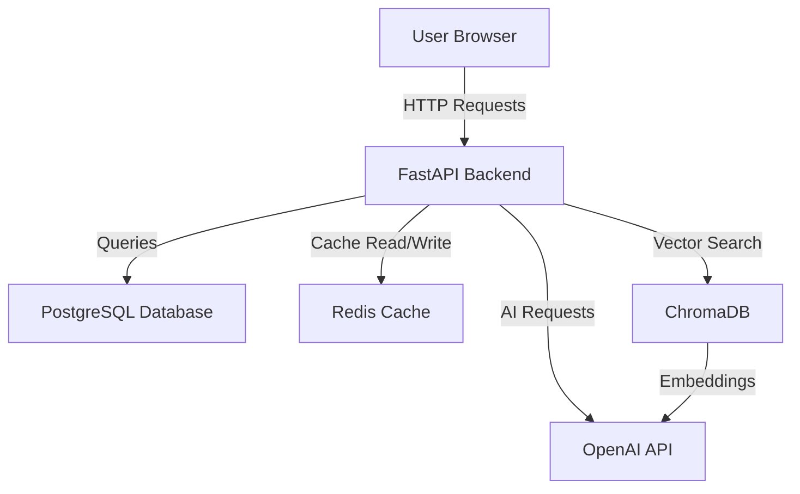

# Documentation: README, Swagger, and Architecture Diagrams

**Module 17 — Full-Stack AI Product: Capstone Development | Topic 6**

---

## Why Documentation Matters

You have built an amazing capstone project. But if nobody can understand what it does or how to set it up, it might as well not exist. Documentation is the bridge between your code and the rest of the world.

Think of it like building a beautiful house but never putting up a house number or a nameplate. Visitors will walk right past it. Your README is the nameplate, your API docs are the floor plan, and your architecture diagram is the blueprint.

### Who Reads Your Documentation?

| Reader | What They Need | Where They Look |
|--------|---------------|-----------------|
| Recruiter | Quick overview: what it does, tech stack, screenshots | README (first 30 seconds) |
| Technical interviewer | Architecture decisions, code quality, testing | README + architecture diagram |
| Fellow developer | How to set up and run locally | README setup section |
| Future you (6 months later) | Why you made certain decisions | README + code comments |
| API consumer | Endpoint details, request/response formats | Swagger docs |

---

## Writing a Professional README

Your README is the most important file in your repository. It is the first thing anyone sees on your GitHub page.

### README Template

```markdown
# Project Name

One-sentence description of what your project does.


---

## About

A 2-3 sentence description of the project. What problem does it solve?
Who is it for? What makes it special?

**Built for the TechPath Institute Full-Stack AI Capstone (Module 17)**

### Key Features

- Feature 1: Brief description
- Feature 2: Brief description
- AI Feature: What the AI does and why it is useful

---

## Tech Stack

| Layer | Technology |
|-------|-----------|
| Backend | FastAPI, Python 3.11 |
| Database | PostgreSQL 15 |
| Cache | Redis 7 |
| AI/ML | OpenAI GPT-3.5, LangChain, ChromaDB |
| Frontend | HTML/CSS/JS, Tailwind CSS, HTMX |
| CI/CD | GitHub Actions |
| Deployment | Render / Railway / VPS |

---

## Architecture


Brief description of the architecture:
- Frontend sends requests to the FastAPI backend
- Backend handles business logic and database operations
- AI service uses RAG pipeline with ChromaDB for context retrieval
- Redis caches frequently accessed data and AI responses

---

## Getting Started

### Prerequisites

- Python 3.11+
- PostgreSQL 15+
- Redis 7+
- Poetry (Python package manager)

### Installation

1. Clone the repository:
   ```bash
   git clone https://github.com/yourusername/project-name.git
   cd project-name
   ```

2. Install dependencies:
   ```bash
   poetry install
   ```

3. Set up environment variables:
   ```bash
   cp .env.example .env
   # Edit .env with your actual values
   ```

4. Set up the database:
   ```bash
   poetry run alembic upgrade head
   ```

5. Start the server:
   ```bash
   poetry run uvicorn app.main:app --reload
   ```

6. Open your browser:
   - API docs: http://localhost:8000/docs
   - App: http://localhost:8000

---

## API Documentation

Full API documentation is available at `/docs` (Swagger UI) when
the server is running.

### Key Endpoints

| Method | Endpoint | Description |
|--------|----------|-------------|
| POST | /api/v1/auth/register | Register a new user |
| POST | /api/v1/auth/login | Login and get JWT token |
| GET | /api/v1/items | List all items (paginated) |
| POST | /api/v1/items | Create a new item |
| POST | /api/v1/chat/ask | Ask the AI chatbot a question |

---

## Running Tests

```bash
# Run all tests
poetry run pytest

# Run with coverage report
poetry run pytest --cov=app --cov-report=html

# Run a specific test file
poetry run pytest tests/test_auth.py -v
```

---

## Project Structure

```
app/
|-- main.py          # FastAPI application entry point
|-- config.py        # Configuration and settings
|-- database.py      # Database connection
|-- models/          # SQLAlchemy models
|-- schemas/         # Pydantic validation schemas
|-- api/v1/          # API route handlers
|-- crud/            # Database operations
|-- services/        # Business logic (AI, email, etc.)
tests/               # Test files
alembic/             # Database migrations
```

---

## License

This project is licensed under the MIT License.

---

## Acknowledgments

- Built during the TechPath Institute Full-Stack AI Program
- AI features powered by OpenAI
```

### README Best Practices

| Do | Do Not |
|----|--------|
| Include a screenshot or demo GIF | Leave the README empty |
| List the tech stack clearly | Assume the reader knows your stack |
| Provide step-by-step setup instructions | Say "just run the app" |
| Mention what the AI feature does | Add AI without explaining it |
| Keep it updated as you add features | Write it once and forget |

---

## Swagger / OpenAPI Docs in FastAPI

FastAPI automatically generates interactive API documentation. This is one of FastAPI's biggest advantages — you get beautiful, testable docs for free.

### How FastAPI Auto-Generates Docs

When you define endpoints with type hints and Pydantic schemas, FastAPI creates two documentation pages automatically:

| URL | Format | Best For |
|-----|--------|----------|
| `/docs` | Swagger UI | Interactive testing, trying out endpoints |
| `/redoc` | ReDoc | Reading documentation, sharing with team |

### Making Your Docs Better

```python
from fastapi import FastAPI

app = FastAPI(
    title="Student Exam Portal API",
    description="""
    A platform for students to upload, search, and get AI-powered summaries
    of past exam papers.

    ## Features
    * Upload exam papers (PDF)
    * Search by subject, year, and college
    * AI-powered paper summaries
    * User authentication with JWT
    """,
    version="1.0.0",
    contact={
        "name": "Vikram - TechPath Institute",
        "email": "vikram@techpath.biz",
    },
)
```

### Documenting Individual Endpoints

```python
@router.post(
    "/papers",
    response_model=PaperResponse,
    summary="Upload an exam paper",
    description="Upload a PDF exam paper with subject, year, and college metadata.",
    responses={
        201: {"description": "Paper uploaded successfully"},
        400: {"description": "Invalid file format (only PDF allowed)"},
        401: {"description": "Not authenticated"},
    },
)
async def upload_paper(
    file: UploadFile,
    subject: str = Form(..., description="Subject name, e.g., Data Structures"),
    year: int = Form(..., description="Exam year, e.g., 2024"),
    college: str = Form(..., description="College name, e.g., RGPV Bhopal"),
    db: AsyncSession = Depends(get_db),
    current_user: User = Depends(get_current_user),
):
    """Upload a new exam paper PDF with metadata."""
    pass
```

### Grouping Endpoints with Tags

```python
# In your router files
router = APIRouter(
    prefix="/papers",
    tags=["Exam Papers"],  # Groups endpoints in Swagger UI
)

ai_router = APIRouter(
    prefix="/chat",
    tags=["AI Features"],
)

auth_router = APIRouter(
    prefix="/auth",
    tags=["Authentication"],
)
```

---

## Creating Architecture Diagrams

An architecture diagram shows how the different parts of your system connect. It is the most impressive visual in your capstone presentation.

### Tools for Architecture Diagrams

| Tool | Type | Best For | Cost |
|------|------|----------|------|
| Excalidraw | Online whiteboard | Quick, hand-drawn style diagrams | Free |
| draw.io (diagrams.net) | Online diagramming | Professional diagrams, export to PNG/SVG | Free |
| Mermaid | Text-based (in Markdown) | Diagrams that live in your README | Free |

### Mermaid Diagram in Your README

You can include diagrams directly in your README using Mermaid syntax. GitHub renders them automatically.

```markdown

```

### What to Include in Your Architecture Diagram

| Component | Include? | Why |
|-----------|----------|-----|
| Frontend | Yes | Shows the user-facing layer |
| Backend API | Yes | Core of your application |
| Database | Yes | Shows data persistence |
| Cache (Redis) | Yes, if used | Shows performance optimization |
| AI Service | Yes | Your differentiating feature |
| External APIs | Yes, if used | Shows integrations |
| CI/CD Pipeline | Optional | Shows DevOps maturity |

---

## Writing CONTRIBUTING.md

If your project is open-source or you want to show collaboration skills:

```markdown
# Contributing to Project Name

Thank you for considering contributing!

## How to Contribute

1. Fork the repository
2. Create a feature branch: `git checkout -b feature/your-feature-name`
3. Make your changes
4. Run tests: `poetry run pytest`
5. Run linting: `poetry run ruff check app`
6. Commit your changes: `git commit -m "Add your feature"`
7. Push to your fork: `git push origin feature/your-feature-name`
8. Open a Pull Request

## Code Style

- We use Black for formatting: `poetry run black app tests`
- We use Ruff for linting: `poetry run ruff check app tests`
- Type hints are required for all functions

## Reporting Bugs

Open an issue with:
- Steps to reproduce
- Expected behavior
- Actual behavior
- Screenshots (if applicable)
```

---

## Documentation Checklist

Before submitting your capstone, verify every item:

| Document | Status | Notes |
|----------|--------|-------|
| README.md with project description | _ | First thing recruiters see |
| Screenshot or demo GIF in README | _ | Visual proof it works |
| Setup instructions (step-by-step) | _ | Someone else should be able to run it |
| Tech stack table | _ | Shows what you used |
| API documentation (/docs working) | _ | Swagger auto-generated |
| Architecture diagram | _ | Shows system design thinking |
| .env.example file | _ | Template for environment variables |
| Test instructions | _ | How to run tests |
| LICENSE file | _ | Usually MIT for capstone projects |

---

*TechPath Institute — Full-Stack AI Product: Capstone Development*
